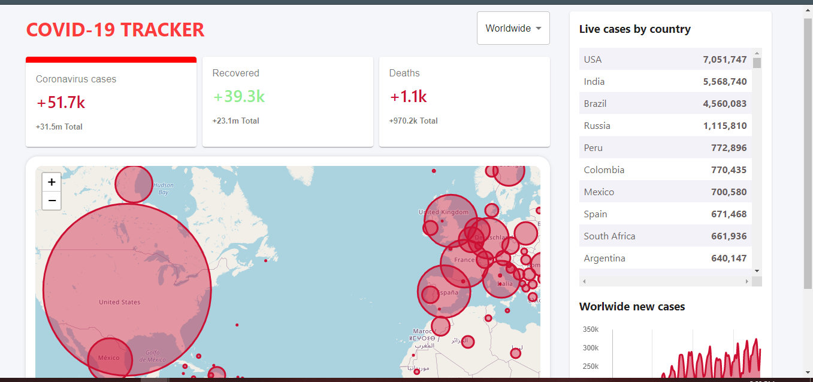

### `COVID-19 TRACKER`

An web based application to track covid cases on daily purpose. Cases can be tracked worldwide or country specific.
Developed using react js.

 
 

Installation and Setup Instructions

Clone down this repository. You will need node and npm installed globally on your machine.

Installation:

### `npm install`

To Start Server:

### `npm start`

To Visit App: https://covid-19-tracker-74f00.web.app/

localhost:3000/

Public api used. Visit https://disease.sh/
